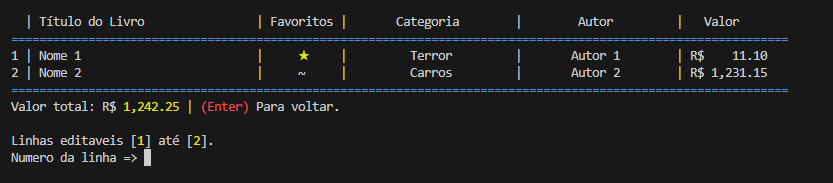
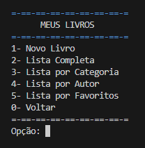
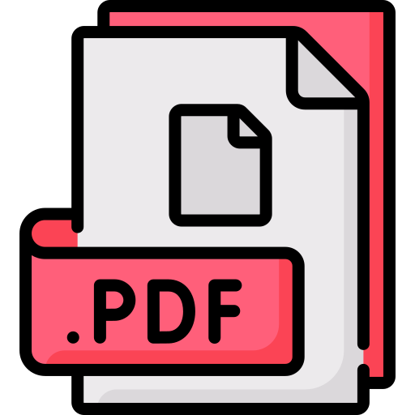

# Projeto Python : Biblioteca de livros (Basico)
Projeto avaliativo para a cadeira - Fundamentos da Programação.    
Projeto realisado por:    
+ **Adriano Barnard Medeiros**    
+ **João pedro Maranhão**    
+ **Caio Correia**    
+ **Igor Cubits**

> O programa foi criado para gerenciar uma simples biblioteca de livros,
> onde o usuário pode adicionar os livros que ele deseja comprar e os livros que ja possui. 
> Sendo organizados por    
> (Nome, favorito, Categoria, Autor e Valor)
>> É possivel adicionar novas Categorias ao cadastras um novo livro.    
>> Também é possivel fazer alterações em cada um dos já livros registrados.
>
> 
>
> O usuário pode filtrar e verificar seus livros por:    
> + **Categoria**
> + **Autor**
> + **Livros Favoritos**
>
>
>
##  Manual

    
